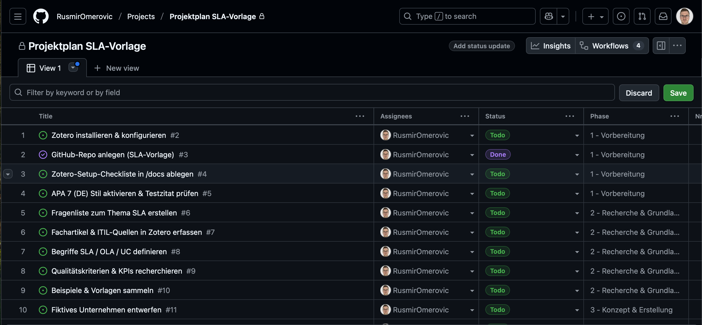
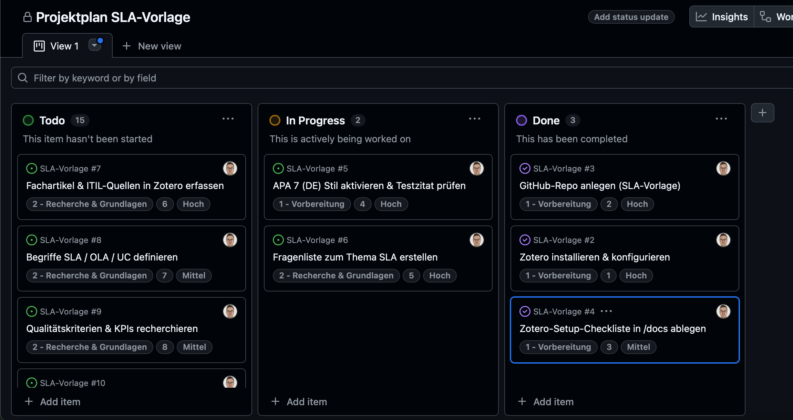

# 🧰 se-tools

**se-tools** ist ein leichtgewichtiges Tool-Set aus Bash-Skripten, um neue Projekte in Sekunden anzulegen, sicher zu pushen, Repos zu löschen und standardisierte Merges/Deploys durchzuführen.  
Es richtet sich an DevOps-/DevSecOps-Workflows mit GitHub & Supabase.

---

## Installation

```bash
git clone https://github.com/RusmirOmerovic/se-tools.git
cd se-tools
chmod +x ./*
echo 'export PATH="$HOME/se-tools:$PATH"' >> ~/.zshrc
source ~/.zshrc
```

---

## Voraussetzungen

- **Git**  
- **GitHub CLI (`gh`)** → ersetzt komplett das alte Token-Handling  
- Optional: **Supabase CLI** (für Edge-Functions/Testing)  

---

## Erste Schritte

1. **GitHub einrichten (einmalig):**
   ```bash
   gh auth login
   gh auth status
   ```
   Danach brauchst du kein Token mehr – alle Befehle nutzen automatisch deine GitHub-Session.

2. **Neues Projekt anlegen (GitHub + Supabase):**
   ```bash
   projectnew meinProjekt
   ```
   - Voraussetzung: erstelle deine Zugangsdaten zunächst 
      bei https://frontend-se-cyan.vercel.app/
   - Du wirst nach deiner **E-Mail + Passwort** gefragt (wie im Frontend)  
   - Repo wird automatisch aus Template erstellt und gepusht  
   - Projekt + Meilenstein wird in Supabase Datenbank angelegt  

3. **Weitere Standardbefehle:**
   ```bash
   newproject <name>   # nur GitHub-Repo anlegen
   pushrepo            # commits sicher pushen
   deleterepo          # Repo lokal & remote löschen
   merge-main          # Feature → main mergen
   merge-test          # Feature → test mergen
   ```
# 🧩 Backlog anlegen → GitHub Projects (Issues)

## 📋 GitHub Project & Backlog Import (Kanban Setup)
Um das Kanban-Board automatisch mit den Issues aus der CSV zu befüllen, müssen einmalig die GitHub-Projektrechte aktualisiert und ein Projekt angelegt werden.

### 1️⃣ GitHub CLI Token aktualisieren

Falls beim Erstellen eines Projekts die Fehlermeldung
**error: your authentication token is missing required scopes [project read:project]**
erscheint, führe aus:
```bash
gh auth refresh -s project,read:project
```

Danach im Browser bestätigen, um die neuen Scopes zu aktivieren.

### 2️⃣ Neues GitHub-Projekt anlegen
Erstelle ein neues Project (v2) unter deinem User (nicht im Repo):
```bash
gh project create \
  --owner RusmirOmerovic \
  --title "Rechnungsprogramm"
```
Projektliste prüfen:
```bash
gh project list --owner @me
```

Beispielausgabe:
```
NUMBER  TITLE              STATE  ID
8       Rechnungsprogramm  open   PVT_kwHOCOnMRM4BHWDj
```
3️⃣ Backlog (CSV) importieren (Beispiel von mir)
```bash
gh-import-backlog \
  --owner RusmirOmerovic \
  --repo RusmirOmerovic/Rechnungsprogramm \
  --project "Rechnungsprogramm" \
  --csv issues_rechnungsprogramm.csv \
  --mode issues --update
```
Die Issues werden automatisch erstellt und dem Project „Rechnungsprogramm“ zugewiesen.


### 📄 Beispiel: CSV für Backlog-Import

Lege im Projektordner eine Datei `docs/Backlog_<Projektname>.csv` an:

```csv
Phase,Nr,Aufgabe,Status,Priorität,Beschreibung
1 - Vorbereitung,1,Zotero installieren & konfigurieren,Todo,Hoch,Installiere Zotero und richte APA 7 ein
1 - Vorbereitung,2,Github-Repo anlegen,Done,Hoch,Repository mit README und Lizenz erstellen
2 - Recherche,3,ITIL-Grundlagen recherchieren,Todo,Mittel,Fokus auf SLA/OLA/UC Unterschiede
```

Dann importieren mit:

```bash
gh-import-backlog --owner <USER> \
  --repo <USER/REPO> \
  --project "Projektplan SLA-Vorlage" \
  --csv docs/Backlog_SLA-Vorlage.csv \
  --mode issues --update
  ```

- Erstellt pro CSV-Zeile ein Issue und fügt es dem Projekt hinzu
- Felder: Phase, Nr, Prioriät, Status werden gesetzt


➡️ Tipp:

```bash
--create-project legt automatisch ein neues GitHub-Project an
--update aktualisiert vorhandene Issues
CSV kann direkt aus Excel oder Google Sheets exportiert werden (UTF-8, Komma-getrennt)
```






📨 Sicher pushen mit "pushrepo"-Befehl
```bash
pushrepo -m "Update Backlog & tools"   # sicher committen + rebase-pull + push
pushrepo -n                            # Dry-run
pushrepo -q -m "silent push"           # leiser Modus ohne Konsolen-Output
```
🔍 Flags erklärt
```bash
FLAG	                 BEDEUTUNG                       BEISPIEL

-m	            Commit-Nachricht direkt angeben	         pushrepo -m "Update Scripts"
-n	            Dry-Run: Vorschau ohne Änderung           pushrepo -n
-q	            Quiet: minimale Ausgabe	                  pushrepo -q -m "silent push"
```
---

## Was sich geändert hat (2025)

- 🔑 **Kein GitHub-Token** mehr nötig – alles läuft über `gh`.  
- 🔐 **Keine Supabase-Secrets** mehr im Code – User loggt sich mit eigenen Credentials ein.  
- 🌍 **Skalierbar**: Jeder registrierte User kann Projekte sowohl im Frontend (Vercel) als auch über CLI erstellen.  

---

## Konfiguration der Shell

Öffne deine Konfigurationsdatei `.zshrc` oder `.bashrc` im Terminal:
```bash
nano ~/.zshrc
```

Füge den Pfad zu den Skripten hinzu:
```bash
# se-tools global Befehle
export PATH="$HOME/se-tools:$PATH"
```

Dann speichern (**Ctrl+O** → Enter), schließen (**Ctrl+X**) und Shell neu laden:
```bash
source ~/.zshrc
```

---

## Mehr Infos

👉 Detaillierte Workflows, Edge-Function-Integration und Beispiele findest du im  
➡️ [se-tools Wiki](https://github.com/RusmirOmerovic/se-tools/wiki)
